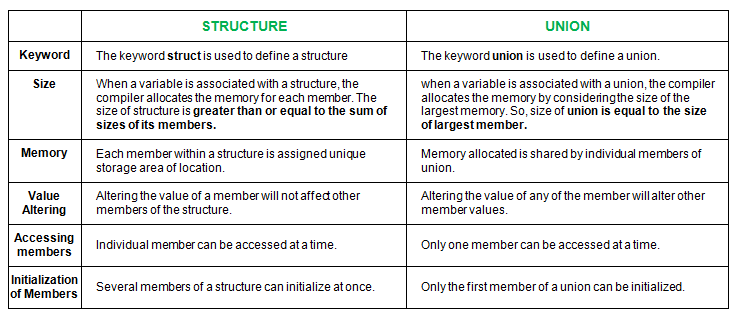

Similarities between Structure and Union

- Both are user-defined data types used to store data of different types as a single unit.
- Their members can be objects of any type, including other structures and unions or arrays. 
    A member can also consist of a bit field.
- Both structures and unions support only assignment = and sizeof operators. 
    The two structures or unions in the assignment must have the same members and member types.
- A structure or a union can be passed by value to functions and returned by value by functions. 
    The argument must have the same type as the function parameter. 
    A structure or union is passed by value just like a scalar variable as a corresponding parameter.
- ‘.’ operator is used for accessing members.

Differences

